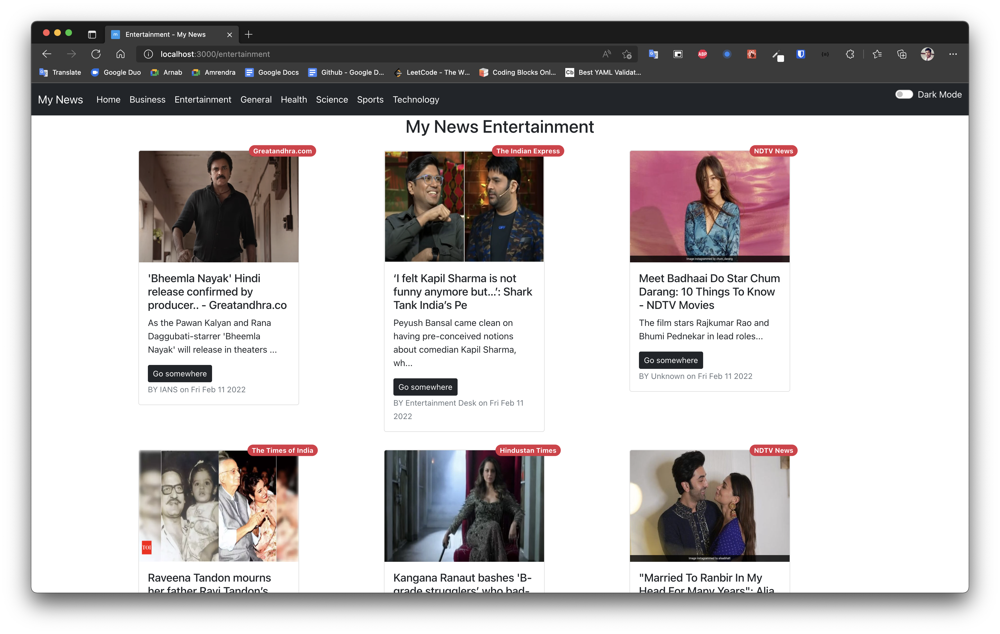
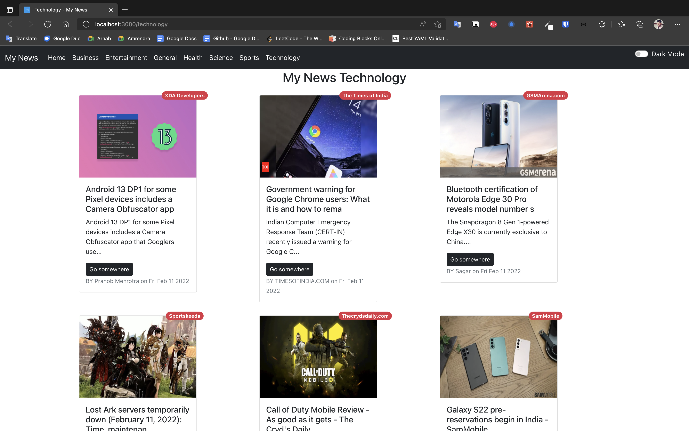
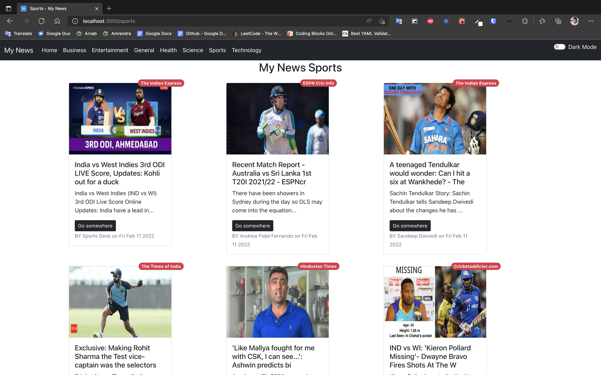

# Building My News App Using React Functional Compoent

## Images

---

# How You Can use the app in your local system 🥳🥳🥳🥳

- Clone The repository
- Then run **yarn** on your comment line
- creat a folder .env.local on project directory
- Then go to https://newsapi.org/
- Creat A account a get your api key
- And creat a variable call **REACT_APP_NEWS_API**
  - like REACT_APP_NEWS_API="your api key"
- Then start your devolopement server by **yarn start**
- And End Happy Coding 😃😃😃😃
